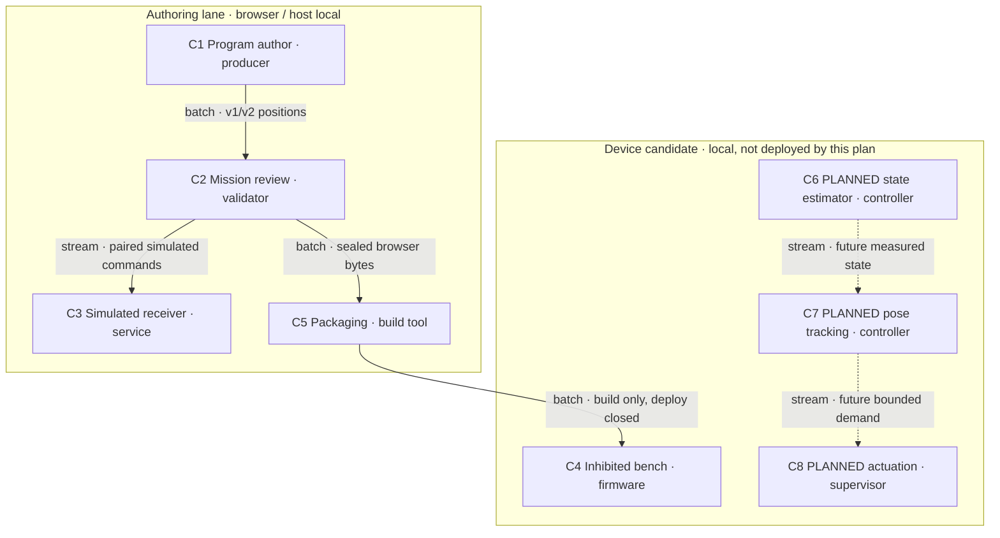

# Reference implementation: programmatic drone flight

One joined plan owns **cross-system integration and acceptance**, not the producer,
browser or firmware implementations. All five roles consume
`GAMEXR-FLIGHT-PATH-INTEGRATION-001@0.2.1`. The parent is
[firmware planning](../../docs/drone/prd-tad-adr-mvp-gtm-usb-diagnostics-firmware.md)
at `GAMEXR-USB-DIAGNOSTICS-FIRMWARE-001@0.3.3`.
This replaces the 0.1.0 integration note; its immutable history remains in F1.

**Current outcome:** program → simulated trace → browser review → authenticated
host receiver → acknowledged simulated landing is locally demonstrated. The real
board separately exposes IMU, OTA and inhibited bench commands. **No physical
position-path execution exists.** A successful simulator run cannot authorize flight.

## Reference implementation sources and ownership

The requested [authoring guideline][guideline] at the frontmatter revision governs
this plan. Its [templates][templates], [readiness][readiness] and [verification][verification]
define the roles and evidence semantics. [Grounding record][grounding] binds 15
inspected source objects by repository, exact revision, path and SHA-256.

| ID | Exact source / functional owner | Native surface / disposition |
|---|---|---|
| G1 | `agentic-graph` `f87cb03d772f2b457a14145645b7d240758500bc`; Program Authoring Owner | `createLearningFlightPath` in `canvas/src/features/python-learning/learningFlightPath.ts`; reuse v1/v2 producer |
| B1 | `GameXR` `9a051ac63960886a52411016aab992380bbedcd6`; Browser Control Owner | `readFlightPath`, `FlightPathRun`, `FlightPathView`, `ReceiverState`; reuse review, transport and simulated ACK |
| F1 | `GameXR` `fca206ca36970424c33a2c40c504a24eae7985f0`; Device Firmware Owner | `app_main.c`, `network.c`, `bench.c`, `ota_guard.c`, packaging lock; retain physical inhibition |
| H1 | [Historical reference](historical-flight-reference.json); Hardware Verification Owner | measured old parameters/source-default input curves only; no verified new flight tune or vendor-code import |
| O1 | [START][start], [RELEASE][release], [DEPLOY][deploy]; Release Owner | existing admission, source publication and separate device effects; reuse, no new orchestrator |

The producer's [capability plan][graph-plan] and receiver's [capability plan][browser-plan]
remain their own requirements/design owners; current working copies may advance
beyond G1/B1. Consume the pinned objects in grounding, not a mutable branch alias.
Successor handoff: Graph `e4e7317aa5bceee0432eb4f119e8168c9f27448c`
([PR1299](https://github.com/huijoohwee/agentic-graph/pull/1299)) and ACOS catalog
`6311e842962b58fabd19225201513b7783f010c1` ([PR951](https://github.com/huijoohwee/agentic-canvas-os/pull/951)).
[Handoff evidence][successor-evidence] verifies all seven clean Canvas artifact files.
The owner reports eight mobile WebKit tests passed, Graph CI still running and catalog
CI green at handoff; integrate Graph before catalog. No wire change or new physical
acceptance; F1's sealed inputs remain G1/B1 until separately repackaged and verified.

## PRD

**Context:** the operator asked to run a programmatic flight path on a real board,
while separate authoring, browser and firmware lanes were at different revisions.
**Intent:** one inspectable path from authored program to an explicitly selected
execution environment, with honest results and recoverable failures.
**Directive:** establish the smallest verified integration first; advance physical
effects only through the acceptance gates below. The current increment implements M1 source convergence and prepares M2 acceptance.

### People, pain and value

| Pain / evidence | User, buyer and beneficiary | Hook → break → fix → close | Reuse / value |
|---|---|---|---|
| P1: operator-observed; “can run GameXR flight path to execute physical flight?” | current maker/operator; buyer unknown; learner benefits | author a route → simulation confused with aircraft → display mode and capability gaps → show receiver ACK and motor boundary | G1/B1/F1; prevent wrong execution expectations |
| P2: operator-observed worktree drift; cockpit pin lagged B1 | maintainer/operator; buyer unknown | reuse parallel work → stale build/source joins → exact source/artifact pins → reproducible candidate | existing package owner; support-time savings unmeasured |
| P3: unvalidated market hypothesis | robotics educator or hobbyist; payer and willingness to pay unverified | teach code-to-motion → setup friction → optional assisted rehearsal → measured learner completion | browser/local harness; defer commercial claims |

Pain is not `demand-proven`; no paid-customer evidence exists. Rank P1 then P2
because both are observed and near-built; P3 follows discovery, not feature expansion.
**0:** useful local components exist; integration, flight readiness and demand differ.
**1:** a new operator completes one reviewed simulated mission and retrieves its
ACK/stop evidence in one session; physical flight is a later, separately measured outcome.

### Stories and scope

As an operator, I want to author, review and explicitly run a bounded mission so I
can distinguish planned motion, receiver acceptance and actual measured motion.
As a maintainer, I want exact producer/consumer/build identities so I can reproduce
or roll back a candidate without overwriting parallel work.

- **Must now:** R1–R5: export/review, bounded simulated execution, failure handling,
  exact packaging, and honest capability display. All trace to P1 or P2.
- **Should next:** R6: clean-phone first-run timing, accessibility and offline recovery.
- **Future Must for physical flight:** R7–R12, in dependency order. They are unimplemented gates.
- **Could:** additional mission shapes after accepted envelope and demand evidence.
- **Won't this increment:** physical actuation, calibration activation, autonomous
  takeoff, cloud services, paid infrastructure, new protocol registry, native adapters,
  imported vendor controller, multi-aircraft coordination, or public deployment.

### Acceptance and evidence joins

Each VCC is `Verify the stated outcome by the named check under its constraints`.
Existing satisfied results are scoped to E1–E6; future checks below are acceptance
designs, **not existing commands or completed tests**. TAD consumes these IDs.

| Requirement / VCC | Measurable outcome and check | Constraint / owner / evidence |
|---|---|---|
| R1 / V1 | valid completed paths import; malformed, oversized, physical-claim and discontinuous paths reject; B1 path/transfer suites | v1/v2, no automatic Run; P1; E1 |
| R2 / V2 | all 541 recorded poses accepted, final `[540,4,0,0,0]`; retained replay | simulated receiver only; P1; E2 |
| R3 / V3 | replay/mode mixing reject; 250 ms lease expiry clears authority; stop clears setpoints | B1 tests and F1 host tests; P1; E1/E3; physical stop unproved |
| R4 / V4 | stale revision/bytes/extra artifacts reject; exact build fits slot and cache caps | F1 packaging/tests; P2; E3/E4 |
| R5 / V5 | dedicated dashboard shows IMU, ACK, virtual throttle and motors OFF; BRAKE zeros; zero game canvases | synthetic UI only; P1; E5; latest phone candidate pending |
| R6 / V6 | clean operator completes five-action rehearsal within 5 min; keyboard/touch labels usable; offline reload and link-loss recover explicitly | proposed timing ceiling; browser QA; timed physical-phone walkthrough pending |
| R7 / V7 | signed sensor-to-body transform verified on every axis; matched-warm-up repeats and six-face fit meet frozen tolerances | measured jig/reference; hardware owner; no active calibration yet |
| R8 / V8 | estimator/rate-loop replay and fault injection meet frozen RMS, latency and saturation bounds for every fixture | controller owner; host checks then inhibited hardware timing; pending |
| R9 / V9 | propeller-free test identifies every motor/order/direction; arm refuses invalid health; measured stop latency meets envelope | device owner + physically prepared operator; powered measurements pending |
| R10 / V10 | position/altitude/heading estimates meet frozen error/freshness bounds against independent reference over full route | localization owner; sensor choice and measurements pending |
| R11 / V11 | tracking simulation and hardware-in-loop meet envelope; stale estimate/link, low battery and reset invoke tested responses | tracking owner; physical protocol and fault policy pending |
| R12 / V12 | authorized controlled mission has measured takeoff, tracking, landing and postflight logs within approved envelope | test operator; all earlier physical gates and environment review required |

### Success metrics and limits

| Metric | Baseline / evidence | Target / observation window |
|---|---|---|
| Local / delivered rung | dev-proven / undocumented for this complete E2E scope | runtime-ready only when every in-scope VCC passes; no delivery claim |
| TTV actions / elapsed | unmeasured clean first run; nine-second simulated route is not TTV | five actions: open, complete program, send, connect, Run; ≤5 min; next clean-operator session |
| Repeatability | one 541-position recorded replay | three separate clean bench sessions without hidden retries; next pilot |
| Physical tracking error / completion | unavailable | freeze numeric envelope before R8–R12; no fabricated baseline |
| Serving model tokens / paid calls | deterministic local paths; no serving model | 0 tokens and paid calls per mission |
| Provider spend / total ownership | $0 new provider spend; operator time, electricity and hardware costs unknown | no paid plan/add-on/overage; record non-provider costs separately |
| ROI score | `(impact × reach)/(build hours + monthly TCO + monthly token cost)` inputs not measured | unscored, not used to claim profit or savings; collect during pilot |

## TAD

Reference implementation: G1, B1 and F1 retain their capability ownership. The
integration architect owns this cross-system acceptance order, not a second runtime.

### Components, reuse and evidence-derived readiness

| Component | Responsibility / source owner | Reuse decision and smallest delta | Local / delivered rung |
|---|---|---|---|
| C1 author/export | produce completed kinematic trace; G1 | reuse exact exported schema; no Python execution in receiver | dev-proven / undocumented; E1/E2 |
| C2 review/control | validate imported mission and require explicit Run; B1 | reuse views, link decoder and transport | dev-proven / undocumented; E1/E6; R6 remains |
| C3 simulated receiver | validate lease and acknowledge sampled positions; B1 | retain local simulation semantics | dev-proven / undocumented; E1/E2 |
| C4 device bench | report sensors, accept bounded virtual-rate bench commands; F1 | retain inhibition, calibration/OTA owners | dev-proven / undocumented for 0.4.8; E3–E5 |
| C5 packaging | join clean browser revision and sealed bytes; F1 | reuse lock/checker; no sibling-module extraction | dev-proven / undocumented; E4 |
| C6 state/control | transform sensors, estimate attitude and stabilize rates; proposed firmware extension | extend F1 after V7; no gain transplant | spec-complete / undocumented |
| C7 localization/tracking | measure pose and track physical references; proposed owner seam | choose measured local sensing before controller adapter | spec-complete / undocumented |
| C8 actuation/supervision | map outputs and enforce arm/fault policy; proposed firmware extension | extend single board owner after V8/V9 | spec-complete / undocumented |

### Five flows and trust boundaries

| Flow | Current path | Physical successor / failure behavior |
|---|---|---|
| User journey | author → simulate/land → review → connect → Run → inspect ACK | select hardware → verify envelope → explicit arm/start → observe → land; unavailable now |
| Workflow | completed trace → bounded export → validation → session/challenge → ACK → completion | approval-bound mission → estimator/controller → measured output; no auto-retry of uncertain effect |
| Data | Python source stays with author; JSON positions + digests go to review; ACK log stays local | authenticated versioned physical references + timestamps + calibration/frame IDs; flight logs retained locally |
| Orchestration | deterministic validation/dispatch; one run; stop on lease/freshness error; no model loop | supervision owns fault response; proposed controller bounded by measured timing; no LLM in control loop |
| Topology | browser author/reviewer ↔ local host receiver; separate phone ↔ device HTTPS bench | onboard real-time controller; external measured pose input if selected; radio loss never delegates stabilization to browser |

Build/release order is acyclic: portable contract → producer export/receiver tests →
sealed browser artifact → firmware package → firmware build → source integration →
separately authorized device install. Runtime request/ACK exchanges are bidirectional.
Data residency is local browser/host/device; no cloud is needed to execute the current bench.

### Diagram D1 — reference implementation

Class: runtime topology. Notation: Mermaid `flowchart TB`. Target: declared 2D flowchart
surface, fenced body ingest only. Version: 1. Caption: current authoring sends reviewed
positions to a **simulated host**, while the device separately offers inhibited bench
control; the nodes labelled **PLANNED** have no executable path from today's mission.
The table below is the text equivalent; colour carries no required meaning.

| Diagram | Surface / ingest | Nodes / typed edges / clusters | Projection check |
|---|---|---|---|
| D1 | flowchart / body fence | 8 / 6 / 2 | E7 command below; projection receipt |

Every node's lane and residency are declared by its named boundary. The C1–C8
inventory above owns responsibilities and readiness. D1 shows no physical-ready claim.

### Contracts and intentional differences

| Interface | Actual current contract / limits | Integration rule |
|---|---|---|
| I1 export | `agentic-drone-flight-path/v1` or `/v2`; `model=kinematic`; `physicalAircraft=false`; 60 Hz; `[tick,x,z,heading,altitude]` | local-xz-altitude-m-heading-deg is a simulation frame, not a measured body/world transform |
| I1 bounds | 2–7201 contiguous samples; ≤120 s; ≤500,000 bytes; x/z ±8 m, altitude 0–4 m, heading [0,360); step ≤0.050002 m | origin first and landed last; these are simulator bounds, not an aircraft flight envelope |
| I2 transfer | v2 source URL points to current source document; gzip/base64url fragment ≤16,000 chars, decompressed ≤500 kB | source link/digest is not an immutable source bundle; local export alone grants no execution |
| I3 host run | explicit paired enable, session, one-use challenge, monotonic sequence, 250 ms lease, `simulated-drone-path/v1` | planned and receiver-accepted positions remain distinct; no GPIO or aircraft output |
| I4 device bench | HTTPS telemetry/IMU-window plus keyed same-origin `GXR1` HELLO/SET/STOP; virtual throttle ≤20%, rates ≤1 rad/s | no position-path endpoint; motor gates held low; 250 ms lease; no automatic conversion from I1 |
| I5 package/OTA | lock revision + artifact digest + exact files/hashes; slot 0x140000; 300 kB total gzip, 250 kB compressed asset | only exact reviewed candidate; authenticated upload/integrity checks do not establish flight readiness |
| I6 future physical | proposed versioned frame, unit, timebase, envelope, calibration and capability binding | unknown version/revision, missing fields, stale pose or unsupported capability reject before arming |

I6 is a requirement, not an implemented schema. Keep domain validation with owners:
portable position grammar → mission semantics → transport adapter → UI. Do not
extract one common parser for intentionally different simulated-position and
device-rate inputs. Retain local semantics and test accepted/rejected inputs,
canonical bytes, cancellation, expiry, replay and cross-session attempts.

### Physical envelope and failure policy

Before R8–R12, the hardware/controller owners must freeze a machine-readable test
envelope with measured basis: body/world transforms and handedness, loop/sample
rates, estimator RMS/latency bounds, motor mapping/direction, max tilt/rate/thrust,
valid battery range/cutoffs, pose error/age limits, stop deadline, allowed volume,
tracking/landing error, maximum mission time, operator recovery and test environment.
These numbers are **unresolved**. Missing values block physical effects; simulation
limits and historical gains cannot fill them. A phone camera preview is not a
localization system. Accelerometer/gyro data alone is not a verified position reference.

| Failure | Current behavior / check | Required physical successor |
|---|---|---|
| stale ACK/link/hidden page | revoke lease, stop; E1/E3/E5 | onboard response measured for each flight phase; landing versus motor-stop policy unresolved |
| restart/unknown session/replay | fresh explicit enable; reject old commands | no auto-resume; immutable mission identity and activation record |
| sensor invalid / bias drift | report invalid or stop bench; calibration inactive | estimator health prevents arm; quantify drift across warm-up/temperature |
| missing localization / bad frame | no physical route implemented | prohibit position mode; test reference jumps and wrong signs before actuation |
| battery out of range | null battery voltage; calibration KIV | independent meter/full-range validation before physical acceptance |
| interrupted update | retained image and rollback guards; prior operator recovery report | power-loss/automatic rollback still require separate physical evidence |

### Invocation, privacy and operations

Reference implementation: reuse existing UI, APIs and tools; this table adds no registry.

| Surface | Mode / owner / evidence | Unsupported or effect boundary |
|---|---|---|
| author Results → send/export | prepare-only; C1/I1–I2; E6 | imported text cannot execute Python or authorize flight |
| reviewer connect/Run/Stop | simulated control; C2–C3/I3; E1/E2 | physical-aircraft path rejected |
| device `/api/telemetry`, `/api/imu-window` | read-only; C4/I4; prior captures and E3 | calibration remains inactive |
| device `/api/bench`, `/api/ota` | explicit authenticated bench/update effects; C4/I4–I5 | discovery is not authorization; this doc turn invokes neither |
| official build MCP | prepare-only; C5; E4 | no new MCP gateway; flash is a separate operation |
| runtime inspect/control WebMCP | existing game surface, not a proven physical mission interface | programmatic aircraft tools unsupported; define owner/VCC before advertising |
| `/`, `@`, `#` | existing command, document/device binding and semantic-tag discovery | these names are not implemented physical-flight routes or grants |

Program logs may reveal source and movement. Keep them in the existing local artifact
store under operator control; no automatic upload or retention deletion. Never copy
pairing keys, private TLS files or Wi-Fi credentials into planning/public evidence.
Phone camera frames remain in-browser; permission and HTTPS requirements still apply.
Licenses: preserve existing FOSS/MIT project code and pinned official SDK licenses;
restricted historical vendor implementation is not imported. New dependencies require
license and zero-spend review. Existing device hardware, operating system and browser
are operator-provided prerequisites, not a claim that every platform component is FOSS.
Developer path: inspect owner contract → local rehearsal → authenticate supported
surface → inspect ACK/events → reconcile unknown outcomes → retain support receipt →
retire only an exact unused revision after rollback evidence. No parallel service/store.

## ADR

Reference implementation decisions at the common 0.2.1 join; constraints precede ranking.

| Decision | Alternatives / feasibility | Chosen reason, consequence and revisit trigger |
|---|---|---|
| A1 accepted: reuse owner contracts/pins | direct reuse passes existing contracts; contract adapter passes only with unit/frame proof; whole-worktree copy fails single-owner; new shared package lacks two justified consumers | pin G1/B1/F1; no duplicate runtime; retain old pins for rollback; refresh after owner release |
| A2 accepted: keep simulation separate | local host simulation passes no-actuation and zero-provider-spend; map positions directly to throttle fails state/control prerequisites | simulation gives evidence now; real flight remains unavailable; revisit after V7–V11 |
| A3 proposed: local physical tracking | onboard-only IMU dead reckoning fails current position-evidence gate; external local vision/reference and onboard range/flow are FOSS-compatible candidates but accuracy, hardware and timing unverified | candidates incomparable until measurements; no winner or purchase; localization owner prepares bounded comparison |
| A4 accepted: browser/local delivery | existing mobile browser + local host/device passes scope; native app rewrite fails user preference; paid managed service fails zero-spend | retain browser camera and local compute; revisit only on measured capability gap |

No contested provider verdict is asserted. Runtime control has no model/agent loop.
Deployment-model TCO: existing local host/device incurs $0 new provider fees but
unmeasured electricity/support/hardware cost; self-managed external service adds
operations without current value; paid managed variant fails scope; consolidated
local host is already reused. No blended “total cost is zero” or savings claim.

## MVP

M1 progress: authorized receiver PR34 merged as `01b18b515b05e027d966eb157746332d2d830bd0`.
Firmware refresh `4682a3928a468a430933508e2020ffc7c274e98f` inherits its exact browser-only
CI and passed original-scope readmission; no workflow copy or reservation expansion.
[Combined bench proof][bench-proof] accepted all 541 samples and rejected physical claims.
[Actual browser run][browser-bench] landed at tick540 and inhibited control; WebGL was
unavailable, so rendering and physical-phone timing are not certified.
Required local validation passed: evaluators, candidate build and 123 behavior tests.
The [implementation receipt][implementation] carries source publication/provider status.

MVP consumes PRD R1–R6, TAD C1–C5/I1–I5 and ADR A1/A2/A4 at 0.2.1.
R1–R5 have local evidence; R6 clean-phone/TTV acceptance is outstanding. Therefore
the joined E2E product is `dev-proven`, not `runtime-ready`; physical capabilities
remain `spec-complete` under their future VCCs, with no delivered evidence.

### Demo skeleton and roadmap

| Beat | Maximum time | Visible result / VCC |
|---|---|---|
| Hook | 20 s | explain P1 and selected simulated mode |
| Probe | 60 s | author/run a bounded program and land; V1 |
| Reveal | 45 s | reviewed samples and exact source identity; V1/V4 |
| Run mission | 45 s | explicit connect/Run; ACK progresses to landed; V2 |
| Close | 30 s | stop/recovery evidence, physical effects unavailable; V3/V5 |

Total ≤200 s after stated prerequisites; this is a proposed demo budget, not measured
clean-install TTV. Domain object: a versioned mission with evidence of execution.
Four experience-rubric ratings are **unassessed**; no L3+ claim, demand or flight rating.

| Phase / priority | Reuse → smallest delta / owner | Prerequisite → exit | Bounds / stop / recovery / successor |
|---|---|---|---|
| M0 observed P1/P2: coherent plan | existing integration note → joined roadmap / integration architect | exact sources → documentation checks E7 | original increment: ~20 min, 4 file effects, 40 KiB, 20k-token authoring ceiling, $0 new spend; stop on owner conflict |
| M1 observed P2: source convergence | F1 + browser CI owner → browser-only CI/source publication | owner scope + network → exact PR/CI receipt | 20 min active increment, ≤3 modules/20 KiB/12k tokens; external CI/network waits have no ETA; retain fca206c |
| M2 observed P1: reproducible phone bench | B1/F1 → exact candidate review and R6 walkthrough / browser QA | M1 as applicable; exact install grant if needed → V1–V6 with clean phone timing | 20 min preparation, ≤2 modules/20 KiB/12k tokens; physical operator readiness is recheck trigger |
| M3 physical foundation | IMU capture/fit owners → measured frame/calibration + estimator/rate harness / controller owner | no-actuation fixture → V7/V8 | one ≤20 min design/test increment, ≤3 modules/40 KiB/16k tokens; no powered output; preserve inactive calibration |
| M4 physical output acceptance | single board owner → motor map/arm/fault validation / hardware owner | V7/V8 + prepared apparatus and explicit powered-test scope → V9 | bounded test protocol before operation; stop on unknown mapping/health; retained inhibited image |
| M5 measured tracking | local sensing candidates → selected pose reference and tracker / localization owner | V9 + independently measured pose → V10/V11 | first increment ≤20 min/3 modules/40 KiB/16k tokens; no hardware spend; missing error bounds block progression |
| M6 controlled physical mission | accepted controller/envelope → staged takeoff/track/land / test operator | V7–V11 + exact environment/effect authorization → V12 | per-test duration/volume fixed in envelope; no unsupported emergency policy; restore inhibited predecessor after failed acceptance |

P3 commercialization waits for observed repeat bench value. Stop/pivot if three pilot
attempts cannot achieve the timed bench outcome without maintainer intervention;
fix the smallest failed owner seam before adding flight features. All later phase
bounds require a fresh plan for code; this document does not authorize their effects.
No added always-loaded runtime module; guideline/document bytes load only for planning.

## GTM

Reference implementation: GTM consumes the same MVP/PRD/TAD/ADR join; it creates no
additional requirements. Current customer is the requesting operator; external
learner/educator segments and geography are hypotheses. “Why now” is the existing
local authoring/receiver/board capability, not validated market timing.

| Stream / rank | Segment exists now / offer hypothesis | Mechanism / demand / collection |
|---|---|---|
| S1 nearest optional $1 experiment | operator exists; external maker unverified; one assisted local simulation rehearsal with receipt, proposed one-time USD1 price | payment mechanism unimplemented; willingness to pay unvalidated; revenue/cash unknown, no evidence of collection |
| S2 later educator kit | classroom/pilot segment unverified; repeatable lesson + setup/support | defer until repeat learning outcome and support-time measurements |
| S3 physical mission service | flight capability and buyer absent | Won't this increment; V12, obligations and external demand first |

Constraints rank S1 before S2: reuse existing demo, no new billing/service, explicit
opt-in discovery only. S3 fails current capability constraints. Do-nothing/manual
rehearsal remains a valid zero-purchase alternative. No outreach, charge, billing
integration, market-size claim or audience presentation is authorized by this plan.
Learn loop: after three local sessions record completion, interventions, elapsed
time and support effort; propose a priced interview only after a separate user request.
Feed results into a successor Context; do not rewrite this accepted observation.

Business/financial discovery remains incomplete: TAM/SAM/SOM need two independent
methods; acquisition/retention, IP/jurisdiction, variable cost, payment fees, unit
economics and cash timing are unverified. A price hypothesis is not recognized revenue.
No forecast, linked statements, scenario runway or funding ask is asserted. Bootstrap
existing equipment only; no equity/dilution plan. Pitch deck, business plan and financial
model projections are deferred, never audience-ready. C02/C09/C11/C12/C15 track them.

## Evidence, release and runtime — reference implementation

All relative filenames below resolve under [the integration artifact directory][artifacts]
unless another link is given. Exact bytes/check results remain in [its receipt][receipt].

| ID | Named check / invocation | Recorded result / surface / limitation |
|---|---|---|
| E1 | B1 `node --test tests/drone-flight-path.test.ts tests/drone-flight-transfer.test.ts` | 9 pass; `browser-contract-tests.log`; authoring; simulation and transport only |
| E2 | recorded-path `parseFlightPath` → `ReceiverState.accept` replay | `path-replay.json`: 541 ACK, final `[540,4,0,0,0]`, expiry and physical-claim reject; authoring; deterministic clock, no hardware |
| E3 | F1 `node --test tests/usb-diagnostics-firmware.test.ts` | 31 pass; `firmware-host-tests.log`; authoring; no powered-motor evidence |
| E4 | F1 `package-cockpit.mjs`, official `build_project`, `package-ota.mjs package-app`, `npm run check` | 28 assets/279570 gzip, 26210 drone bytes; app 1159888/1310720 bytes; 3 native checks pass; authoring |
| E5 | actual browser Start → 40% throttle → BRAKE + `/preview/evidence` | synthetic ACK, virtual80/1000, zero physical outputs, stop, zero canvas; `dashboard-server-evidence.json`; authoring |
| E6 | owner native Send → review → explicit Connect/Run | [browser receipt][browser-evidence]: landing `[540,4,0,0,0]`; authoring; mutable sender successor and no physical-phone certification |
| E7 | `node /Users/huijoohwee/Documents/GitHub/GameXR/.artifacts/programmatic-flight-implementation-2026-09-26/check-docs.mjs` | [documentation check][doc-check]: 19/19 pass; D1 has 8 nodes/6 edges/2 clusters; frontmatter, joins, links, source hashes and VCCs only; not flight certification |
| E8 | operator Check device + OTA/recovery reports in this task | last reported 0.4.6 after 0.4.7/manual recovery; predecessor evidence only, not delivered 0.4.8 |

0.4.8 app SHA256: `6a13d0cfa8a495c38aa272ffca2a42efcdb0fbc581b4d73620d70e69b5a91d4b`.
Browser artifact digest: `579290ee35e9314c9abe79be3dd63cc854642746a17fc780dcb0aeaf174c98f0`.
Named invocations E2/E5 describe retained actions, not repository commands; no fake CLI
is implied. Reproduce via the retained source and fixture references before reusing
their results on a changed candidate. Physical captures and pairing links stay private.

| Boundary | Source → target | Required authority/evidence | State / recovery |
|---|---|---|---|
| source publication | admitted lane → review branch/PR | exact source/check receipt; inherited browser-only CI | receiver PR34 integrated; firmware branch refreshed and locally validated; provider status in implementation receipt |
| source integration | PR → protected main | required green provider checks + exact integration grant | PR34 merged by explicit user approval; firmware candidate integration remains closed |
| device install | reviewed image → exact board | current target/readback, retained backup, explicit install scope | closed this turn; no flash/reset/OTA; retained 0.4.6 recovery |
| physical actuation | inhibited image → powered test | V7–V9 prerequisites + prepared apparatus and operation-specific authority | closed; motor inhibit is the rollback state |
| physical mission | validated controller → controlled test space | V7–V11, frozen envelope, environment review and explicit mission scope | closed; no flight-ready claim |
| production/payer | tested artifact → public offer/payment | delivery proof, audience/payment request and applicable obligations | closed; no deployment, outreach or payment |

Development, source release and runtime receipts are separate. This revision inherits the protected browser/receiver source and updates
planning. Release uses O1; inherited CI runs browser checks and omits native adapter
builds. Preserve the local commit, historical backups and exact browser/firmware pins.
Do not clean up or replace active owner worktrees to make the ledger appear complete.

## Coverage and findings

Join: `GAMEXR-FLIGHT-PATH-INTEGRATION-001@0.2.1`; each source section below inherits
exact revision 0.2.1. Coverage is a disposition, not proof of readiness.

| Domain | Decision | Source section / evidence or gap | Accountable function / next check |
|---|---|---|---|
| C01 | covered | PRD people/pain; operator request, WTP unknown | Product Owner / pilot interview |
| C02 | deferred | GTM market sizing absent; no external segment evidence | GTM Owner / two-method sizing after discovery scope |
| C03 | covered | PRD scope + ADR/GTM alternatives and offer hypothesis | Product Owner / priced interest only when requested |
| C04 | covered | PRD R1–R6/journeys; clean-phone acceptance pending | Browser QA / V6 |
| C05 | covered | TAD C1–C8, I1–I6, five flows, D1 | Integration Architect / E7 and owner revision change |
| C06 | covered | TAD limits/privacy/faults; physical cases explicitly pending | Assurance Owner / V7–V12 before effects |
| C07 | covered | ADR A1–A4; localization undecided | Integration Architect / compare measured candidates |
| C08 | covered | MVP, demo and E1–E7; no runtime-ready claim | QA Owner / repeat clean sessions |
| C09 | deferred | GTM acquisition/payment/retention unvalidated | GTM Owner / after repeat bench value and outreach grant |
| C10 | covered | TAD developer path, local support/retention, release recovery | Operations Owner / exact next release incident/check |
| C11 | deferred | GTM IP/jurisdiction obligations not reviewed for physical/commercial use | Product Owner / before physical/public offering |
| C12 | deferred | GTM linked finances/scenarios absent; actual TCO unknown | Financial Owner / real costs and payment assumptions |
| C13 | covered | GTM bootstrap-only decision; MVP milestones, no funding ask | Product Owner / revisit only if capital requested |
| C14 | covered | release boundaries and next RAO; exact source/build receipts | Release Owner / scoped source publication |
| C15 | deferred | GTM audience projections absent; no audience action | Technical Writer / requested audience + validated assumptions |
| C16 | covered | MVP stop threshold, GTM learn loop and successor | Product Owner / three pilot outcomes |

**Coverage:** 16/16 dispositioned; 11/16 applicable domains covered; five deferred;
zero not-applicable. Covered architecture may still contain planned, unbuilt components.
E7 checks a bounded structural/provenance set. Full guideline-wide rule classification
and coverage denominator are unassessed; do not call this exhaustive conformance.

| Finding Type | Severity | Rule anchor | Artifact reference | Evidence excerpt | Remediation |
|---|---|---|---|---|---|
| unimplemented-guideline | major | `from-0-to-1-coverage-contract#1` | C02/C09/C11/C12/C15 | “five deferred” | specification change: assigned owners supply records at stated triggers |
| missing-economics-metric | major | `time-to-value#2` | PRD metrics | “unmeasured clean first run” | locally reproducible check: time V6 before baseline sign-off |
| unimplemented-guideline | major | `rule-identity--classification#3` | coverage | “coverage denominator are unassessed” | documentation change: classify remaining rules before claiming full alignment |
| scenario-set-incomplete | major | `venture-record-pitch-deck-business-plan--financial-model#5` | GTM | “No forecast, linked statements, scenario runway” | specification change: financial owner completes models before dependent audience action |

Tracked findings do not authorize physical effects. Counts for this recorded set:
blocker 0, major 4, minor 0; other finding types 0 **within this bounded review**.
This is not an independent exhaustive alignment verdict. Deterministic E7 is a
mechanism separate from document assertions; its scope and failures remain explicit.

## Planning record and next action

### 2026-09-26

| PRD-TAD-ADR-MVP-GTM | CID | RAO | Updated Date |
|---|---|---|---|
| `GAMEXR-FLIGHT-PATH-INTEGRATION-001@0.2.1` | C: G1/B1/F1 and E1–E6 prove separate local paths · I: make E2E capability and remaining gates inspectable · D: Implement M1 source convergence and M2 bench preparation; preserve physical gates. | R: Flight Integration Architect · A: Integrate the exact receiver PR, refresh firmware, verify the combined bench · O: compatible source and retained receipts; no hardware effect · check: E7 plus bench-proof | 2026-09-26 |

Next bounded action: Release Owner completes firmware source publication from the
refreshed lane; completion requires its exact PR and required green checks. Receiver
closeout remains blocked by its older mission candidate binding; checkout and recovery
bytes are retained. That administrative gap does not widen firmware or hardware authority.
After that, Browser QA performs V6 on a named exact candidate. Calibration/physical
axis work remains a separate next hardware prerequisite; no activation is implied.
Original M0 budget: ~20 min active target, 4 file effects, <40 KiB added text,
20k-token ceiling, no new runtime modules/services and $0 new provider spend. Actual
agent tokens, wall-time attribution and electricity are unavailable; do not invent
zero measurements. M1 budget: ~20 min active target, ≤3 authored modules/20 KiB;
protected-source inheritance is separately identified. External provider waits have
condition-based rechecks. See receipts for observed bytes/check duration.

[guideline]: /Users/huijoohwee/Documents/GitHub/huijoohwee.github.io/guidelines/prd-tad-adr-mvp-gtm-guidelines.md
[templates]: /Users/huijoohwee/Documents/GitHub/huijoohwee.github.io/guidelines/prd-tad-adr-mvp-gtm-templates.md
[readiness]: /Users/huijoohwee/Documents/GitHub/huijoohwee.github.io/guidelines/prd-tad-adr-mvp-gtm-readiness.md
[verification]: /Users/huijoohwee/Documents/GitHub/huijoohwee.github.io/guidelines/prd-tad-adr-mvp-gtm-verification.md
[start]: /Users/huijoohwee/Documents/GitHub/agentic-os/docs/START-WORKFLOW.md
[release]: /Users/huijoohwee/Documents/GitHub/agentic-os/docs/RELEASE-WORKFLOW.md
[deploy]: /Users/huijoohwee/Documents/GitHub/agentic-os/guides/DEPLOY-WORKFLOW.md
[graph-plan]: /Users/huijoohwee/Documents/GitHub/.worktrees/agentic-graph/device-0232231d4a19--drone-learning/docs/documents/prd-tad-adr-mvp-gtm-drone-flight-path.md
[browser-plan]: /Users/huijoohwee/Documents/GitHub/.worktrees/GameXR/device-0232231d4a19--usb-telemetry-observer/docs/drone/prd-tad-adr-mvp-gtm-drone-flight-path.md
[grounding]: /Users/huijoohwee/Documents/GitHub/GameXR/.artifacts/programmatic-flight-plan-2026-09-26/grounding.json
[artifacts]: /Users/huijoohwee/Documents/GitHub/GameXR/.artifacts/flight-path-reconcile-2026-09-26
[receipt]: /Users/huijoohwee/Documents/GitHub/GameXR/.artifacts/flight-path-reconcile-2026-09-26/receipt.json
[browser-evidence]: /Users/huijoohwee/Documents/GitHub/.audit-artifacts/drone-implementation-20260925/popup-fix-in-app-evidence.json
[doc-check]: /Users/huijoohwee/Documents/GitHub/GameXR/.artifacts/programmatic-flight-implementation-2026-09-26/doc-validation.json
[successor-evidence]: /Users/huijoohwee/Documents/GitHub/GameXR/.artifacts/programmatic-flight-plan-2026-09-26/owner-handoff.json
[bench-proof]: /Users/huijoohwee/Documents/GitHub/GameXR/.artifacts/programmatic-flight-implementation-2026-09-26/bench-verification.json
[browser-bench]: /Users/huijoohwee/Documents/GitHub/GameXR/.artifacts/programmatic-flight-implementation-2026-09-26/browser-bench.json
[implementation]: /Users/huijoohwee/Documents/GitHub/GameXR/.artifacts/programmatic-flight-implementation-2026-09-26/receipt.json
